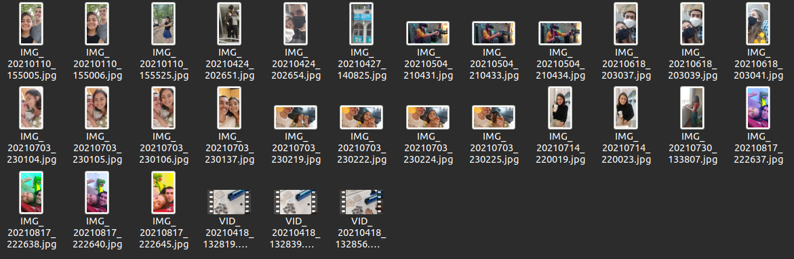
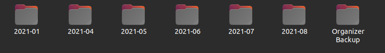

<br />
<p align="center">
  <h3 align="center">Files Organizer</h3>

  <p align="center">
    It's a great tool to organize your photos, videos, documents, etc based on their date.
    When you run the tool, all the files in the current directory will be moved to the corresponding folders organized by month and year.
    <br />
    :warning: Linux limitation: If the file doesn't have a date on it's name, it's not possible to get the file creation date, so the last modified date will be used instead. :warning:
    <br />
	  <br />
    <a href="https://github.com/xandao6/files-organizer"><strong>Explore the docs »</strong></a>
    <br />
    <a href="https://github.com/xandao6/files-organizer/issue">Report Bug</a>
    ·
    <a href="https://github.com/xandao6/files-organizer/issues">Request Feature</a>
  </p>
</p>


<!-- TABLE OF CONTENTS -->
<details open="open">
  <summary>Table of Contents</summary>
  <ol>
    <li>
      <a href="#about-the-project">About The Project</a>
      <ul>
        <li><a href="#features">Features</a></li>
        <li><a href="#built-with">Built With</a></li>
      </ul>
    </li>
    <li>
      <a href="#getting-started">Getting Started</a>
      <ul>
        <li><a href="#pypi-installation">PyPI Installation</a></li>
        <li><a href="#github-installation">GitHub Installations</a></li>
      </ul>
    </li>
    <li><a href="#usage">Usage</a></li>
    <li><a href="#roadmap">Roadmap</a></li>
    <li><a href="#contributing">Contributing</a></li>
    <li><a href="#license">License</a></li>
    <li><a href="#contact">Contact</a></li>
  </ol>
</details>


<!-- ABOUT THE PROJECT -->
## About The Project

<div align="center">
  <a href="https://github.com/xandao6/files-organizer">
    
	  
  </a>
</div>

### Features

* It has 4 ways to identify the files date
* Cross-platform (Windows, Mac, Linux)
* Do a backup by default
* Organize files in folders created by month and year (like 2022-01)

### Built With

* [Python3](https://www.python.org/) - A general-purpose, high-level programming language
* [fire](https://github.com/google/python-fire) - A google library for creating CLI applications


<!-- GETTING STARTED -->
## Getting Started

You can install the tool from PyPI or directly from GitHub. You just need to have Python3 installed.

### PyPI Installation

* Windows:
  ```sh
  pip3 install files-organizer[win]
  ```
* Mac or Linux:
  ```sh
  pip3 install files-organizer
	```

### GitHub Installation

1. Clone the repo
  ```sh
  git clone https://github.com/xandao6/files-organizer.git
  ```

2. Install the tool
  ```sh
  cd files-organizer
  python3 setup.py install
  ```

3. (Windows Only) Install Dependencies
  ```sh
  python3 -m pip install pywin32
  ```

<!-- USAGE EXAMPLES -->
## Usage

* Run the tool on the current directory and do a backup
	```sh
  files-organizer
  ```
* Run the tool on the current directory without backup
	```sh
  files-organizer --no-backup
  ```
* Run the tool specifying the path and do a backup
	```sh
  files-organizer --path=path/to/directory
  ```
* Run the tool specifying the path without backup
	```sh
  files-organizer --path=path/to/directory --no-backup
  ```
* Show the help
  ```sh
  files-organizer --help
  ```


<!-- ROADMAP -->
## Roadmap

See the [open issues](https://github.com/xandao6/files-organizer/issues) for a list of proposed features (and known issues).


<!-- CONTRIBUTING -->
## Contributing

Contributions are what make the open source community such an amazing place to be learn, inspire, and create. Any contributions you make are **greatly appreciated**.

1. Fork the Project
2. Create your Feature Branch (`git checkout -b feature/AmazingFeature`)
3. Commit your Changes (`git commit -m 'Add some AmazingFeature'`)
4. Push to the Branch (`git push origin feature/AmazingFeature`)
5. Open a Pull Request

<!-- LICENSE -->
## License

Distributed under the MIT License. See [LICENSE](./LICENSE.md) for more information.

Free software =)


<!-- CONTACT -->
## Contact

Alexandre Calil - [@xandao6](https://www.linkedin.com/in/xandao6/) - alexandrecalilmf@gmail.com

Project Link: [https://github.com/xandao6/files-organizer](https://github.com/xandao6/files-organizer)


<!-- LINKS & IMAGES Variables-->
<!-- https://www.markdownguide.org/basic-syntax/#reference-style-links -->
[contributors-shield]: https://img.shields.io/github/contributors/xandao6/repo.svg?style=for-the-badge
[contributors-url]: https://github.com/xandao6/repo/graphs/contributors
[forks-shield]: https://img.shields.io/github/forks/xandao6/repo.svg?style=for-the-badge
[forks-url]: https://github.com/xandao6/repo/network/members
[stars-shield]: https://img.shields.io/github/stars/xandao6/repo.svg?style=for-the-badge
[stars-url]: https://github.com/xandao6/repo/stargazers
[issues-shield]: https://img.shields.io/github/issues/xandao6/repo.svg?style=for-the-badge
[issues-url]: https://github.com/xandao6/repo/issues
[license-shield]: https://img.shields.io/github/license/xandao6/repo.svg?style=for-the-badge
[license-url]: https://github.com/xandao6/repo/blob/master/LICENSE.txt
[linkedin-shield]: https://img.shields.io/badge/-LinkedIn-black.svg?style=for-the-badge&logo=linkedin&colorB=555
[linkedin-url]: https://linkedin.com/in/xandao6
